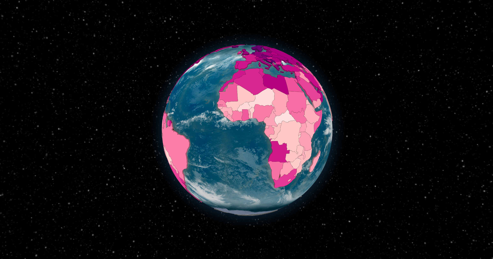

# world-map

A web page that displays a world map, configured by data passed through the URL.

## Examples

_Disclaimer: These are just for demonstration purposes! The data was generated by ChatGPT is almost certainly incorrect._

- [Population](https://world-map.nathanfriend.io/#af_value=37172386&ax_value=26711&al_value=2866376&dz_value=42228429&as_value=55465&ad_value=77006&ao_value=30809762&ai_value=14731&aq_value=1106&ag_value=96286&ar_value=44494502&am_value=2951776&aw_value=105845&au_value=24982688&at_value=8840521&az_value=9939800&bs_value=385640&bh_value=1569439&bd_value=161356039&bb_value=286641&by_value=9483499&be_value=11422068&bz_value=383071&bj_value=11485048&bm_value=63903&bt_value=754394&bo_value=11353142&bq_value=25157&ba_value=3323929&bw_value=2254126&bv_value=0&br_value=209288278&io_value=3000&bn_value=428962&bg_value=7025037&bf_value=19751535&bi_value=11175378&cv_value=531239&kh_value=16249798&cm_value=25216237&ca_value=36624199&ky_value=64174&cf_value=4666377&td_value=15477751&cl_value=18729160&cn_value=1392730000&cx_value=1500&cc_value=600&co_value=49648685&km_value=806153&cg_value=5244363&cd_value=84004989&ck_value=2120&cr_value=4999441&ci_value=25069229&hr_value=4089400&cu_value=11338138&cw_value=159849&cy_value=1189265&cz_value=10625695&dk_value=5792202&dj_value=958920&dm_value=71625&do_value=10627165&ec_value=17084357&eg_value=98423595&sv_value=6420744&gq_value=1308974&er_value=4474062&ee_value=1324820&et_value=109224559&fk_value=2840&fo_value=48497&fj_value=883483&fi_value=5518050&fr_value=66977107&gf_value=290691&pf_value=277679&tf_value=140&ga_value=2119275&gm_value=2280102&ge_value=3912061&de_value=82927922&gh_value=29767108&gi_value=33718&gr_value=10715549&gl_value=56025&gd_value=107825&gp_value=449568&gu_value=167294&gt_value=17247807&gg_value=65228&gn_value=12414318&gw_value=1874309&gy_value=779004&ht_value=11123176&hm_value=0&va_value=799&hn_value=9587522&hk_value=7451000&hu_value=9775564&is_value=356991&in_value=1352642280&id_value=267663435&ir_value=81800269&iq_value=38433600&ie_value=4867309&im_value=84077&il_value=8883800&it_value=60431283&jm_value=2934855&jp_value=126529100&je_value=104200&jo_value=9956011&kz_value=18276499&ke_value=51393010&ki_value=115847&kp_value=25666161&kr_value=51606633&kw_value=4207083&kg_value=6322800&la_value=7061507&lv_value=1927174&lb_value=6848925&ls_value=2108132&lr_value=4818977&ly_value=6678567&li_value=37910&lt_value=2801543&lu_value=607728&mo_value=631636&mg_value=26262368&mw_value=18143315&my_value=31624264&mv_value=444259&ml_value=19077690&mt_value=484630&mh_value=58413&mq_value=396974&mr_value=4403319&mu_value=1265138&yt_value=266150&mx_value=126190788&fm_value=113815&md_value=2706049&mc_value=38682&mn_value=3170208&me_value=622182&ms_value=4989&ma_value=36029138&mz_value=29495962&mm_value=53708395&na_value=2448255&nr_value=11281&np_value=28095714&nl_value=17231017&nc_value=278500&nz_value=4885500&ni_value=6465513&ne_value=22442948&ng_value=195874740&nu_value=1615&nf_value=2009&mp_value=56882&no_value=5311916&om_value=4829483&pk_value=212215030&pw_value=17907&ps_value=4569087&pa_value=4176873&pg_value=8606316&py_value=6956071&pe_value=31989256&ph_value=106651922&pn_value=50&pl_value=38028278&pt_value=10281762&pr_value=3195153&qa_value=2781677&re_value=859959&ro_value=19466145&ru_value=144478050&rw_value=12301939&bl_value=9384&sh_value=4542&kn_value=52441&lc_value=181889&mf_value=31754&pm_value=7012&vc_value=110210&ws_value=196130&sm_value=33860&st_value=211028&sa_value=33699947&sn_value=15854360&rs_value=8772235&sc_value=96762&sl_value=7813215&sg_value=5638700&sx_value=40654&sk_value=5447011&si_value=2080908&sb_value=652858&so_value=15008154&za_value=57779622&gs_value=30&ss_value=10975920&es_value=46723749&lk_value=21670000&sd_value=41801533&sr_value=575991&sj_value=2537&sz_value=1136191&se_value=10175214&ch_value=8516543&sy_value=16906283&tw_value=23773876&tj_value=9321018&tz_value=56318348&th_value=69428524&tl_value=1267972&tg_value=7797694&tk_value=1300&to_value=103197&tt_value=1394973&tn_value=11532127&tr_value=82319724&tm_value=5850908&tc_value=37665&tv_value=11508&ug_value=42723139&ua_value=44622516&ae_value=9630959&gb_value=66460344&us_value=326766748&um_value=300&uy_value=3449299&uz_value=31910641&vu_value=292680&ve_value=28887118&vn_value=95540800&vg_value=29802&vi_value=106977&wf_value=11773&eh_value=652271&ye_value=28498687&zm_value=17351822&zw_value=14439018&af_label=37.2M&ax_label=26.7K&al_label=2.9M&dz_label=42.2M&as_label=55.5K&ad_label=77K&ao_label=30.8M&ai_label=14.7K&aq_label=1.1K&ag_label=96.3K&ar_label=44.5M&am_label=3M&aw_label=105.8K&au_label=25M&at_label=8.8M&az_label=9.9M&bs_label=385.6K&bh_label=1.6M&bd_label=161.4M&bb_label=286.6K&by_label=9.5M&be_label=11.4M&bz_label=383.1K&bj_label=11.5M&bm_label=63.9K&bt_label=754.4K&bo_label=11.4M&bq_label=25.2K&ba_label=3.3M&bw_label=2.3M&bv_label=0&br_label=209.3M&io_label=3K&bn_label=429K&bg_label=7M&bf_label=19.8M&bi_label=11.2M&cv_label=531.2K&kh_label=16.2M&cm_label=25.2M&ca_label=36.6M&ky_label=64.2K&cf_label=4.7M&td_label=15.5M&cl_label=18.7M&cn_label=1.4B&cx_label=1.5K&cc_label=600&co_label=49.6M&km_label=806.2K&cg_label=5.2M&cd_label=84M&ck_label=2.1K&cr_label=5M&ci_label=25.1M&hr_label=4.1M&cu_label=11.3M&cw_label=159.8K&cy_label=1.2M&cz_label=10.6M&dk_label=5.8M&dj_label=958.9K&dm_label=71.6K&do_label=10.6M&ec_label=17.1M&eg_label=98.4M&sv_label=6.4M&gq_label=1.3M&er_label=4.5M&ee_label=1.3M&et_label=109.2M&fk_label=2.8K&fo_label=48.5K&fj_label=883.5K&fi_label=5.5M&fr_label=67M&gf_label=290.7K&pf_label=277.7K&tf_label=140&ga_label=2.1M&gm_label=2.3M&ge_label=3.9M&de_label=82.9M&gh_label=29.8M&gi_label=33.7K&gr_label=10.7M&gl_label=56K&gd_label=107.8K&gp_label=449.6K&gu_label=167.3K&gt_label=17.2M&gg_label=65.2K&gn_label=12.4M&gw_label=1.9M&gy_label=779K&ht_label=11.1M&hm_label=0&va_label=799&hn_label=9.6M&hk_label=7.5M&hu_label=9.8M&is_label=357K&in_label=1.4B&id_label=267.7M&ir_label=81.8M&iq_label=38.4M&ie_label=4.9M&im_label=84.1K&il_label=8.9M&it_label=60.4M&jm_label=2.9M&jp_label=126.5M&je_label=104.2K&jo_label=10M&kz_label=18.3M&ke_label=51.4M&ki_label=115.8K&kp_label=25.7M&kr_label=51.6M&kw_label=4.2M&kg_label=6.3M&la_label=7.1M&lv_label=1.9M&lb_label=6.8M&ls_label=2.1M&lr_label=4.8M&ly_label=6.7M&li_label=37.9K&lt_label=2.8M&lu_label=607.7K&mo_label=631.6K&mg_label=26.3M&mw_label=18.1M&my_label=31.6M&mv_label=444.3K&ml_label=19.1M&mt_label=484.6K&mh_label=58.4K&mq_label=397K&mr_label=4.4M&mu_label=1.3M&yt_label=266.2K&mx_label=126.2M&fm_label=113.8K&md_label=2.7M&mc_label=38.7K&mn_label=3.2M&me_label=622.2K&ms_label=5K&ma_label=36M&mz_label=29.5M&mm_label=53.7M&na_label=2.4M&nr_label=11.3K&np_label=28.1M&nl_label=17.2M&nc_label=278.5K&nz_label=4.9M&ni_label=6.5M&ne_label=22.4M&ng_label=195.9M&nu_label=1.6K&nf_label=2K&mp_label=56.9K&no_label=5.3M&om_label=4.8M&pk_label=212.2M&pw_label=17.9K&ps_label=4.6M&pa_label=4.2M&pg_label=8.6M&py_label=7M&pe_label=32M&ph_label=106.7M&pn_label=50&pl_label=38M&pt_label=10.3M&pr_label=3.2M&qa_label=2.8M&re_label=860K&ro_label=19.5M&ru_label=144.5M&rw_label=12.3M&bl_label=9.4K&sh_label=4.5K&kn_label=52.4K&lc_label=181.9K&mf_label=31.8K&pm_label=7K&vc_label=110.2K&ws_label=196.1K&sm_label=33.9K&st_label=211K&sa_label=33.7M&sn_label=15.9M&rs_label=8.8M&sc_label=96.8K&sl_label=7.8M&sg_label=5.6M&sx_label=40.7K&sk_label=5.4M&si_label=2.1M&sb_label=652.9K&so_label=15M&za_label=57.8M&gs_label=30&ss_label=11M&es_label=46.7M&lk_label=21.7M&sd_label=41.8M&sr_label=576K&sj_label=2.5K&sz_label=1.1M&se_label=10.2M&ch_label=8.5M&sy_label=16.9M&tw_label=23.8M&tj_label=9.3M&tz_label=56.3M&th_label=69.4M&tl_label=1.3M&tg_label=7.8M&tk_label=1.3K&to_label=103.2K&tt_label=1.4M&tn_label=11.5M&tr_label=82.3M&tm_label=5.9M&tc_label=37.7K&tv_label=11.5K&ug_label=42.7M&ua_label=44.6M&ae_label=9.6M&gb_label=66.5M&us_label=326.8M&um_label=300&uy_label=3.4M&uz_label=31.9M&vu_label=292.7K&ve_label=28.9M&vn_label=95.5M&vg_label=29.8K&vi_label=107K&wf_label=11.8K&eh_label=652.3K&ye_label=28.5M&zm_label=17.4M&zw_label=14.4M)
- [Average height](https://world-map.nathanfriend.io/#interpolate_fn=interpolatePuBu&background=white&globe_style=hollow&hover_lift=0.2&default_label=No%20data&af_value=170.18&al_value=173.59&dz_value=172.72&ao_value=173.47&ar_value=171.01&am_value=170.14&au_value=172.6&at_value=178.7&az_value=168.8&bh_value=168.96&bd_value=162.56&by_value=175.43&be_value=176.21&bj_value=160.17&bt_value=166.15&bo_value=160.23&ba_value=176.08&bw_value=164.88&br_value=167.27&bn_value=165.02&bg_value=173.09&bf_value=159.35&bi_value=160.42&cv_value=173.47&kh_value=160.25&cm_value=164.55&ca_value=174.87&cf_value=158.34&td_value=164.37&cl_value=171.67&cn_value=167.1&co_value=166.08&km_value=161.74&cg_value=162.35&cd_value=161.42&cr_value=166.39&ci_value=167.22&hr_value=181.42&cu_value=171.63&cy_value=178.01&cz_value=180.18&dk_value=180.49&dj_value=162.39&do_value=167.71&ec_value=164.9&eg_value=169.97&sv_value=166.93&gq_value=163.62&er_value=162.56&ee_value=175.42&et_value=163.78&fj_value=174.87&fi_value=177.76&fr_value=173.52&ga_value=165.86&gm_value=167.36&ge_value=171.03&de_value=178.38&gh_value=169.5&gr_value=178.28&gl_value=174.41&gt_value=164.38&gn_value=163.56&gw_value=163.35&ht_value=168.53&hn_value=164.07&hk_value=171.34&hu_value=173.51&is_value=180.53&in_value=162.56&id_value=159.37&ir_value=174.17&iq_value=165.88&ie_value=172.02&il_value=176.61&it_value=177.01&jm_value=170.37&jp_value=170.7&jo_value=172.05&kz_value=175.88&ke_value=163.42&ki_value=167.34&kp_value=165.07&kr_value=173.07&kw_value=172.66&kg_value=169.54&la_value=155.25&lv_value=176.55&lb_value=171.39&ls_value=163.81&lr_value=165.2&ly_value=175.48&lt_value=178.56&lu_value=176.87&mo_value=167.74&mg_value=164.89&mw_value=163.63&my_value=165.05&mv_value=165.14&ml_value=161.53&mt_value=172.82&mr_value=169.52&mu_value=171.77&mx_value=167.64&md_value=176.75&mn_value=170.05&me_value=183.01&ma_value=173.6&mz_value=162.82&mm_value=163.83&na_value=168.01&np_value=160.33&nl_value=183.1&nz_value=177.3&ni_value=165.66&ne_value=159.18&ng_value=167.47&no_value=181.08&om_value=175.96&pk_value=165.72&pa_value=168.7&pg_value=163.11&py_value=164.91&pe_value=165.14&ph_value=163.18&pl_value=176.63&pt_value=173.94&qa_value=177.15&ro_value=176.08&ru_value=176.2&rw_value=162.13&ws_value=171.97&sm_value=172.82&st_value=167.24&sa_value=170.98&sn_value=167.14&rs_value=181.37&sl_value=165.26&sg_value=171.23&sk_value=179.64&si_value=177.29&sb_value=170.95&so_value=169.48&za_value=171.64&ss_value=168.01&es_value=173.63&lk_value=167.47&sd_value=168.42&sr_value=170.56&sz_value=167.49&se_value=180.63&ch_value=174.6&sy_value=171.08&tw_value=170.36&tj_value=165.32&tz_value=165.08&th_value=167.24&tg_value=163.55&to_value=174.87&tn_value=173.06&tr_value=174.2&tm_value=170.42&tv_value=169.59&ug_value=164.92&ua_value=176.71&ae_value=176.52&gb_value=177.28&us_value=176.25&uy_value=172.74&uz_value=166.08&vu_value=170.59&ve_value=168.61&vn_value=162.02&ye_value=165.18&zm_value=161.85&zw_value=160.87&af_label=170.18%20cm&al_label=173.59%20cm&dz_label=172.72%20cm&ao_label=173.47%20cm&ar_label=171.01%20cm&am_label=170.14%20cm&au_label=172.6%20cm&at_label=178.7%20cm&az_label=168.8%20cm&bh_label=168.96%20cm&bd_label=162.56%20cm&by_label=175.43%20cm&be_label=176.21%20cm&bj_label=160.17%20cm&bt_label=166.15%20cm&bo_label=160.23%20cm&ba_label=176.08%20cm&bw_label=164.88%20cm&br_label=167.27%20cm&bn_label=165.02%20cm&bg_label=173.09%20cm&bf_label=159.35%20cm&bi_label=160.42%20cm&cv_label=173.47%20cm&kh_label=160.25%20cm&cm_label=164.55%20cm&ca_label=174.87%20cm&cf_label=158.34%20cm&td_label=164.37%20cm&cl_label=171.67%20cm&cn_label=167.1%20cm&co_label=166.08%20cm&km_label=161.74%20cm&cg_label=162.35%20cm&cd_label=161.42%20cm&cr_label=166.39%20cm&ci_label=167.22%20cm&hr_label=181.42%20cm&cu_label=171.63%20cm&cy_label=178.01%20cm&cz_label=180.18%20cm&dk_label=180.49%20cm&dj_label=162.39%20cm&do_label=167.71%20cm&ec_label=164.9%20cm&eg_label=169.97%20cm&sv_label=166.93%20cm&gq_label=163.62%20cm&er_label=162.56%20cm&ee_label=175.42%20cm&et_label=163.78%20cm&fj_label=174.87%20cm&fi_label=177.76%20cm&fr_label=173.52%20cm&ga_label=165.86%20cm&gm_label=167.36%20cm&ge_label=171.03%20cm&de_label=178.38%20cm&gh_label=169.5%20cm&gr_label=178.28%20cm&gl_label=174.41%20cm&gt_label=164.38%20cm&gn_label=163.56%20cm&gw_label=163.35%20cm&ht_label=168.53%20cm&hn_label=164.07%20cm&hk_label=171.34%20cm&hu_label=173.51%20cm&is_label=180.53%20cm&in_label=162.56%20cm&id_label=159.37%20cm&ir_label=174.17%20cm&iq_label=165.88%20cm&ie_label=172.02%20cm&il_label=176.61%20cm&it_label=177.01%20cm&jm_label=170.37%20cm&jp_label=170.7%20cm&jo_label=172.05%20cm&kz_label=175.88%20cm&ke_label=163.42%20cm&ki_label=167.34%20cm&kp_label=165.07%20cm&kr_label=173.07%20cm&kw_label=172.66%20cm&kg_label=169.54%20cm&la_label=155.25%20cm&lv_label=176.55%20cm&lb_label=171.39%20cm&ls_label=163.81%20cm&lr_label=165.2%20cm&ly_label=175.48%20cm&lt_label=178.56%20cm&lu_label=176.87%20cm&mo_label=167.74%20cm&mg_label=164.89%20cm&mw_label=163.63%20cm&my_label=165.05%20cm&mv_label=165.14%20cm&ml_label=161.53%20cm&mt_label=172.82%20cm&mr_label=169.52%20cm&mu_label=171.77%20cm&mx_label=167.64%20cm&md_label=176.75%20cm&mn_label=170.05%20cm&me_label=183.01%20cm&ma_label=173.6%20cm&mz_label=162.82%20cm&mm_label=163.83%20cm&na_label=168.01%20cm&np_label=160.33%20cm&nl_label=183.1%20cm&nz_label=177.3%20cm&ni_label=165.66%20cm&ne_label=159.18%20cm&ng_label=167.47%20cm&no_label=181.08%20cm&om_label=175.96%20cm&pk_label=165.72%20cm&pa_label=168.7%20cm&pg_label=163.11%20cm&py_label=164.91%20cm&pe_label=165.14%20cm&ph_label=163.18%20cm&pl_label=176.63%20cm&pt_label=173.94%20cm&qa_label=177.15%20cm&ro_label=176.08%20cm&ru_label=176.2%20cm&rw_label=162.13%20cm&ws_label=171.97%20cm&sm_label=172.82%20cm&st_label=167.24%20cm&sa_label=170.98%20cm&sn_label=167.14%20cm&rs_label=181.37%20cm&sl_label=165.26%20cm&sg_label=171.23%20cm&sk_label=179.64%20cm&si_label=177.29%20cm&sb_label=170.95%20cm&so_label=169.48%20cm&za_label=171.64%20cm&ss_label=168.01%20cm&es_label=173.63%20cm&lk_label=167.47%20cm&sd_label=168.42%20cm&sr_label=170.56%20cm&sz_label=167.49%20cm&se_label=180.63%20cm&ch_label=174.6%20cm&sy_label=171.08%20cm&tw_label=170.36%20cm&tj_label=165.32%20cm&tz_label=165.08%20cm&th_label=167.24%20cm&tg_label=163.55%20cm&to_label=174.87%20cm&tn_label=173.06%20cm&tr_label=174.2%20cm&tm_label=170.42%20cm&tv_label=169.59%20cm&ug_label=164.92%20cm&ua_label=176.71%20cm&ae_label=176.52%20cm&gb_label=177.28%20cm&us_label=176.25%20cm&uy_label=172.74%20cm&uz_label=166.08%20cm&vu_label=170.59%20cm&ve_label=168.61%20cm&vn_label=162.02%20cm&ye_label=165.18%20cm&zm_label=161.85%20cm&zw_label=160.87%20cm)
- [Favorite color](https://world-map.nathanfriend.io/#globe_style=night&hover_lift=0&background=black&af_color=#2563eb&ax_color=#16a34a&al_color=#dc2626&dz_color=#facc15&as_color=#7e22ce&ad_color=#ffffff&ao_color=#ea580c&ai_color=#f472b6&aq_color=#6b7280&ag_color=#422006&ar_color=#2563eb&am_color=#7e22ce&aw_color=#facc15&au_color=#16a34a&at_color=#dc2626&az_color=#2563eb&bs_color=#facc15&bh_color=#ca8a04&bd_color=#dc2626&bb_color=#2563eb&by_color=#16a34a&be_color=#dc2626&bz_color=#2563eb&bj_color=#16a34a&bm_color=#f472b6&bt_color=#7e22ce&bo_color=#dc2626&bq_color=#2563eb&ba_color=#ffffff&bw_color=#2563eb&bv_color=#ffffff&br_color=#facc15&io_color=#2563eb&bn_color=#16a34a&bg_color=#2563eb&bf_color=#16a34a&bi_color=#facc15&cv_color=#2563eb&kh_color=#dc2626&cm_color=#16a34a&ca_color=#dc2626&ky_color=#2563eb&cf_color=#facc15&td_color=#16a34a&cl_color=#dc2626&cn_color=#dc2626&cx_color=#2563eb&cc_color=#16a34a&co_color=#facc15&km_color=#16a34a&cg_color=#16a34a&cd_color=#dc2626&ck_color=#2563eb&cr_color=#16a34a&ci_color=#ea580c&hr_color=#2563eb&cu_color=#dc2626&cw_color=#2563eb&cy_color=#2563eb&cz_color=#dc2626&dk_color=#dc2626&dj_color=#2563eb&dm_color=#16a34a&do_color=#2563eb&ec_color=#facc15&eg_color=#ca8a04&sv_color=#2563eb&gq_color=#16a34a&er_color=#2563eb&ee_color=#2563eb&et_color=#16a34a&fk_color=#2563eb&fo_color=#2563eb&fj_color=#2563eb&fi_color=#2563eb&fr_color=#2563eb&gf_color=#dc2626&pf_color=#2563eb&tf_color=#ffffff&ga_color=#16a34a&gm_color=#2563eb&ge_color=#dc2626&de_color=#2563eb&gh_color=#16a34a&gi_color=#dc2626&gr_color=#2563eb&gl_color=#ffffff&gd_color=#16a34a&gp_color=#2563eb&gu_color=#2563eb&gt_color=#2563eb&gg_color=#2563eb&gn_color=#16a34a&gw_color=#dc2626&gy_color=#16a34a&ht_color=#dc2626&hm_color=#ffffff&va_color=#ffffff&hn_color=#2563eb&hk_color=#dc2626&hu_color=#dc2626&is_color=#2563eb&in_color=#ea580c&id_color=#16a34a&ir_color=#16a34a&iq_color=#2563eb&ie_color=#16a34a&im_color=#dc2626&il_color=#2563eb&it_color=#16a34a&jm_color=#16a34a&jp_color=#dc2626&je_color=#dc2626&jo_color=#dc2626&kz_color=#2563eb&ke_color=#16a34a&ki_color=#2563eb&kp_color=#dc2626&kr_color=#dc2626&kw_color=#2563eb&kg_color=#dc2626&la_color=#7e22ce&lv_color=#2563eb&lb_color=#dc2626&ls_color=#2563eb&lr_color=#16a34a&ly_color=#dc2626&li_color=#dc2626&lt_color=#facc15&lu_color=#2563eb&mo_color=#dc2626&mg_color=#16a34a&mw_color=#2563eb&my_color=#facc15&mv_color=#2563eb&ml_color=#16a34a&mt_color=#dc2626&mh_color=#2563eb&mq_color=#2563eb&mr_color=#16a34a&mu_color=#facc15&yt_color=#facc15&mx_color=#16a34a&fm_color=#2563eb&md_color=#2563eb&mc_color=#dc2626&mn_color=#2563eb&me_color=#dc2626&ms_color=#2563eb&ma_color=#dc2626&mz_color=#16a34a&mm_color=#dc2626&na_color=#2563eb&nr_color=#2563eb&np_color=#dc2626&nl_color=#ea580c&nc_color=#2563eb&nz_color=#030712&ni_color=#2563eb&ne_color=#16a34a&ng_color=#16a34a&nu_color=#2563eb&nf_color=#16a34a&mp_color=#2563eb&no_color=#dc2626&om_color=#dc2626&pk_color=#16a34a&pw_color=#2563eb&ps_color=#dc2626&pa_color=#2563eb&pg_color=#030712&py_color=#2563eb&pe_color=#dc2626&ph_color=#facc15&pn_color=#2563eb&pl_color=#dc2626&pt_color=#dc2626&pr_color=#2563eb&qa_color=#800000&re_color=#2563eb&ro_color=#2563eb&ru_color=#dc2626&rw_color=#2563eb&bl_color=#2563eb&sh_color=#2563eb&kn_color=#16a34a&lc_color=#2563eb&mf_color=#2563eb&pm_color=#2563eb&vc_color=#16a34a&ws_color=#2563eb&sm_color=#2563eb&st_color=#16a34a&sa_color=#16a34a&sn_color=#16a34a&rs_color=#dc2626&sc_color=#2563eb&sl_color=#16a34a&sg_color=#dc2626&sx_color=#2563eb&sk_color=#2563eb&si_color=#16a34a&sb_color=#2563eb&so_color=#2563eb&za_color=#16a34a&gs_color=#ffffff&ss_color=#2563eb&es_color=#dc2626&lk_color=#ea580c&sd_color=#16a34a&sr_color=#16a34a&sj_color=#ffffff&sz_color=#2563eb&se_color=#2563eb&ch_color=#dc2626&sy_color=#dc2626&tw_color=#dc2626&tj_color=#2563eb&tz_color=#16a34a&th_color=#facc15&tl_color=#dc2626&tg_color=#16a34a&tk_color=#2563eb&to_color=#dc2626&tt_color=#dc2626&tn_color=#dc2626&tr_color=#dc2626&tm_color=#16a34a&tc_color=#2563eb&tv_color=#2563eb&ug_color=#facc15&ua_color=#facc15&ae_color=#dc2626&gb_color=#dc2626&us_color=#2563eb&um_color=#ffffff&uy_color=#2563eb&uz_color=#16a34a&vu_color=#2563eb&ve_color=#facc15&vn_color=#dc2626&vg_color=#2563eb&vi_color=#2563eb&wf_color=#2563eb&eh_color=#facc15&ye_color=#16a34a&zm_color=#ea580c&zw_color=#16a34a&af_label=Blue&ax_label=Green&al_label=Red&dz_label=Yellow&as_label=Purple&ad_label=White&ao_label=Orange&ai_label=Pink&aq_label=Gray&ag_label=Brown&ar_label=Blue&am_label=Purple&aw_label=Yellow&au_label=Green&at_label=Red&az_label=Blue&bs_label=Yellow&bh_label=Gold&bd_label=Red&bb_label=Blue&by_label=Green&be_label=Red&bz_label=Blue&bj_label=Green&bm_label=Pink&bt_label=Purple&bo_label=Red&bq_label=Blue&ba_label=White&bw_label=Blue&bv_label=White&br_label=Yellow&io_label=Blue&bn_label=Green&bg_label=Blue&bf_label=Green&bi_label=Yellow&cv_label=Blue&kh_label=Red&cm_label=Green&ca_label=Red&ky_label=Blue&cf_label=Yellow&td_label=Green&cl_label=Red&cn_label=Red&cx_label=Blue&cc_label=Green&co_label=Yellow&km_label=Green&cg_label=Green&cd_label=Red&ck_label=Blue&cr_label=Green&ci_label=Orange&hr_label=Blue&cu_label=Red&cw_label=Blue&cy_label=Blue&cz_label=Red&dk_label=Red&dj_label=Blue&dm_label=Green&do_label=Blue&ec_label=Yellow&eg_label=Gold&sv_label=Blue&gq_label=Green&er_label=Blue&ee_label=Blue&et_label=Green&fk_label=Blue&fo_label=Blue&fj_label=Blue&fi_label=Blue&fr_label=Blue&gf_label=Red&pf_label=Blue&tf_label=White&ga_label=Green&gm_label=Blue&ge_label=Red&de_label=Blue&gh_label=Green&gi_label=Red&gr_label=Blue&gl_label=White&gd_label=Green&gp_label=Blue&gu_label=Blue&gt_label=Blue&gg_label=Blue&gn_label=Green&gw_label=Red&gy_label=Green&ht_label=Red&hm_label=White&va_label=White&hn_label=Blue&hk_label=Red&hu_label=Red&is_label=Blue&in_label=Orange&id_label=Green&ir_label=Green&iq_label=Blue&ie_label=Green&im_label=Red&il_label=Blue&it_label=Green&jm_label=Green&jp_label=Red&je_label=Red&jo_label=Red&kz_label=Blue&ke_label=Green&ki_label=Blue&kp_label=Red&kr_label=Red&kw_label=Blue&kg_label=Red&la_label=Purple&lv_label=Blue&lb_label=Red&ls_label=Blue&lr_label=Green&ly_label=Red&li_label=Red&lt_label=Yellow&lu_label=Blue&mo_label=Red&mg_label=Green&mw_label=Blue&my_label=Yellow&mv_label=Blue&ml_label=Green&mt_label=Red&mh_label=Blue&mq_label=Blue&mr_label=Green&mu_label=Yellow&yt_label=Yellow&mx_label=Green&fm_label=Blue&md_label=Blue&mc_label=Red&mn_label=Blue&me_label=Red&ms_label=Blue&ma_label=Red&mz_label=Green&mm_label=Red&na_label=Blue&nr_label=Blue&np_label=Red&nl_label=Orange&nc_label=Blue&nz_label=Black&ni_label=Blue&ne_label=Green&ng_label=Green&nu_label=Blue&nf_label=Green&mp_label=Blue&no_label=Red&om_label=Red&pk_label=Green&pw_label=Blue&ps_label=Red&pa_label=Blue&pg_label=Black&py_label=Blue&pe_label=Red&ph_label=Yellow&pn_label=Blue&pl_label=Red&pt_label=Red&pr_label=Blue&qa_label=Maroon&re_label=Blue&ro_label=Blue&ru_label=Red&rw_label=Blue&bl_label=Blue&sh_label=Blue&kn_label=Green&lc_label=Blue&mf_label=Blue&pm_label=Blue&vc_label=Green&ws_label=Blue&sm_label=Blue&st_label=Green&sa_label=Green&sn_label=Green&rs_label=Red&sc_label=Blue&sl_label=Green&sg_label=Red&sx_label=Blue&sk_label=Blue&si_label=Green&sb_label=Blue&so_label=Blue&za_label=Green&gs_label=White&ss_label=Blue&es_label=Red&lk_label=Orange&sd_label=Green&sr_label=Green&sj_label=White&sz_label=Blue&se_label=Blue&ch_label=Red&sy_label=Red&tw_label=Red&tj_label=Blue&tz_label=Green&th_label=Yellow&tl_label=Red&tg_label=Green&tk_label=Blue&to_label=Red&tt_label=Red&tn_label=Red&tr_label=Red&tm_label=Green&tc_label=Blue&tv_label=Blue&ug_label=Yellow&ua_label=Yellow&ae_label=Red&gb_label=Red&us_label=Blue&um_label=White&uy_label=Blue&uz_label=Green&vu_label=Blue&ve_label=Yellow&vn_label=Red&vg_label=Blue&vi_label=Blue&wf_label=Blue&eh_label=Yellow&ye_label=Green&zm_label=Orange&zw_label=Green)

## Usage

To use this map, link to https://world-map.nathanfriend.io with any of the URL hash parameters in the table below. Note that all hash parameter keys must be lowercase (e.g. `us_color`, _not_ `US_color`).

There are two main ways to color the map:

1. **Explicit colors:** specific colors are provided for each country using URL parameters like `us_color=red&ca_color=blue`.
1. **Calculated colors:** numerical values are provided for each country using URL parameters like `us_value=5&ca_value=1`. The map will automatically determine the color of each country based on where it falls in the range of provided values.

These options can be used together; when a country has both a `_value` and a `_color` parameter provided, the `_color` parameter takes precedence.

### URL parameter reference

| Parameter                         | Default             | Example                                     | Description                                                                                                                                                                                                                                 |
| --------------------------------- | ------------------- | ------------------------------------------- | ------------------------------------------------------------------------------------------------------------------------------------------------------------------------------------------------------------------------------------------- |
| `<two-letter country code>_color` | none                | `us_color=red`                              | Renders this country with the provided color. Color can be any valid CSS color (i.e. `red`, `#ff0000`, and `rgba(255, 0, 0, 1)` are all valid). Note that the value must be URL encoded; for example, to specific `#ff0000` as `%23ff0000`. |
| `default_color`                   | `gray`              | `default_color=pink`                        | The default country color.                                                                                                                                                                                                                  |
| `<two-letter country code>_label` | none                | `mx_label=Population: 126.7 million (2021)` | The label text to render when the country is hovered.                                                                                                                                                                                       |
| `default_label`                   | none                | `default_label=No data`                     | The label text to render for countries that have no specific label text provided.                                                                                                                                                           |
| `<two-letter country code>_value` | none                | `ca_value=4.5`                              | The numerical value to assign to this country. The map will automatically determine the country's color based on this value's relative size compared to all other provided country values.                                                  |
| `default_value`                   | `0`                 | `default_value=1.2`                         | The numerical value to assign to all countries that have no specific value provided.                                                                                                                                                        |
| `interpolate_fn`                  | `interpolateYlOrRd` | `interpolate_fn=interpolateRainbow`         | The D3 color interpolation function to use when calculating the color of each country. (Only relevant when using the `<country code>_value` parameters.) See https://github.com/d3/d3-scale-chromatic for a list of all options.            |
| `background`                      | none                | `background=white`                          | A solid color to set as the background. If not provided, an image of a starry sky is used instead.                                                                                                                                          |
| `globe_style`                     | `day`               | `globe_style=hollow`                        | The style to use when rendering the globe. Valid options are `night`, `day`, or `hollow`.                                                                                                                                                   |
| `hover_lift`                      | `0.02`              | `hover_lift=0.5`                            | How high to lift the country when hovered.                                                                                                                                                                                                  |

## Source

This is more-or-less a copy/paste of the ["Choropleth" example](https://github.com/vasturiano/globe.gl/blob/master/example/choropleth-countries/index.html) from [globe.gl](https://globe.gl/), with some additional logic to allow configuration of some properties through the URL.

## Attributions

- [Favicon image by macrovector](https://www.freepik.com/free-vector/globe-earth-world-icons-vector-white-black_10601425.htm#query=globe%20icon&position=0&from_view=search&track=ais) on Freepik

## Developing

- `npm install --global http-server`
- Run `http-server` at the root of the project
